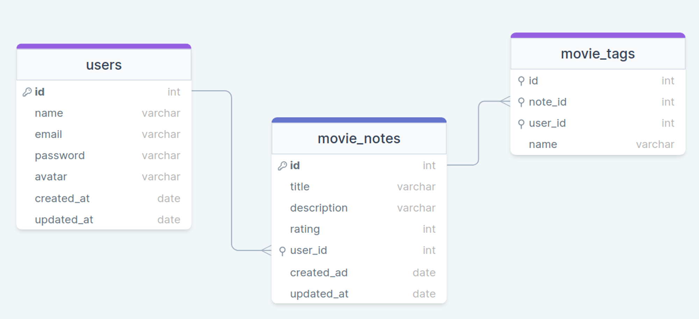

# RocketSeat - Movie API

A ideia é criar uma aplicação em Node.js onde o usuário pode cadastrar um filme, preenchendo algumas informações (nome, descrição, nota) e criando tags relacionadas a ele.

## Diagrama

<div align="center">



</div>

## Como usar

### Instalação

1. Clone o repositório:
    ```bash
    git clone https://github.com/seu-usuario/seu-repositorio.git
    ```
2. Navegue até o diretório do projeto:
    ```bash
    cd seu-repositorio
    ```
3. Instale as dependências:
    ```bash
    npm install
    ```

### Executando a aplicação

1. Inicie o servidor de desenvolvimento:
    ```bash
    npm run dev
    ```
2. Execute as migrações do banco de dados:
    ```bash
    npm run migrate
    ```

### Endpoints

-   **POST /movies**: Cadastra um novo filme.
-   **GET /movies**: Lista todos os filmes cadastrados.
-   **GET /movies/:id**: Obtém detalhes de um filme específico.
-   **PUT /movies/:id**: Atualiza as informações de um filme.
-   **DELETE /movies/:id**: Remove um filme do cadastro.

### Exemplo de Requisição

#### Cadastro de Filme

```js
{
  "method": "POST",
  "url": "http://localhost:3000/movies",
  "headers": {
    "Content-Type": "application/json"
  },
  "body": JSON.stringify({
    "name": "Inception",
    "description": "A mind-bending thriller",
    "rating": 9,
    "tags": ["thriller", "sci-fi"]
  })
}
```
